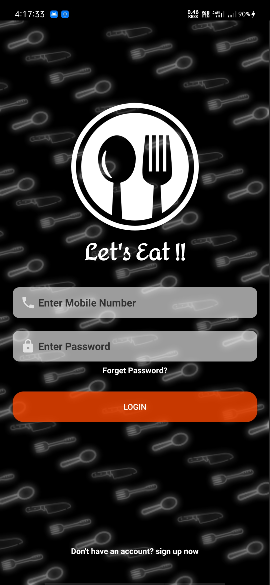
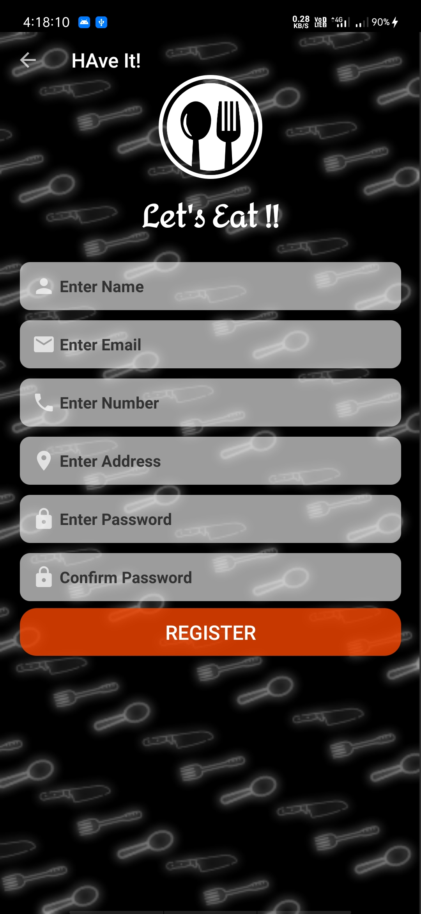
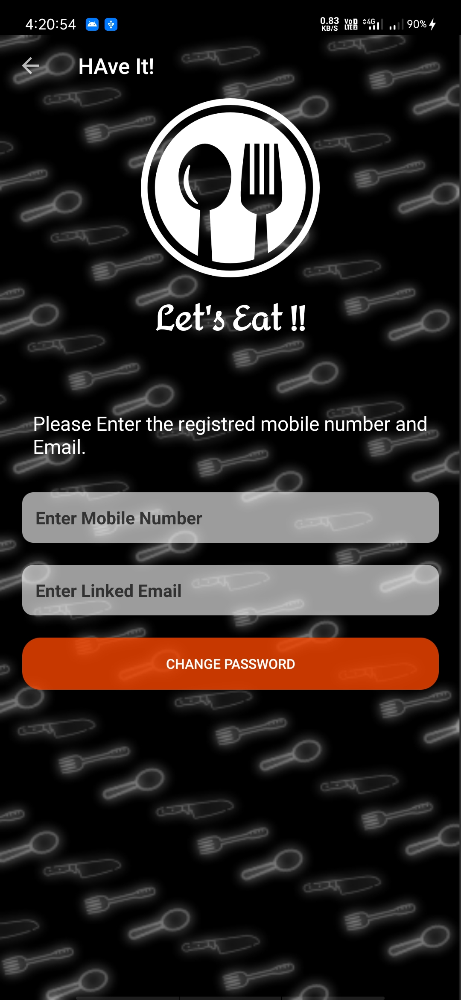
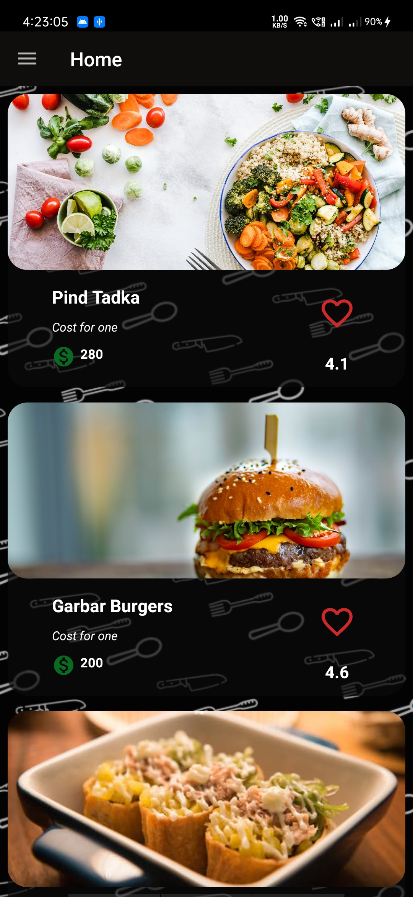
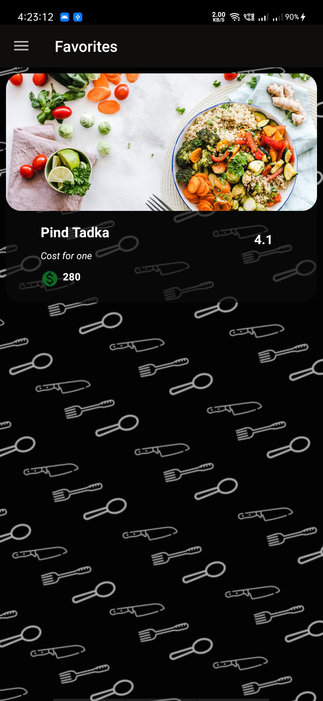
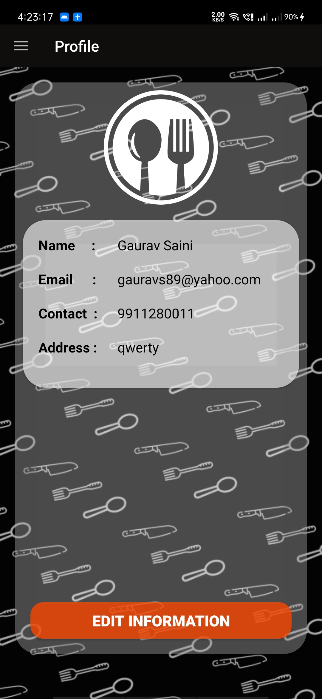
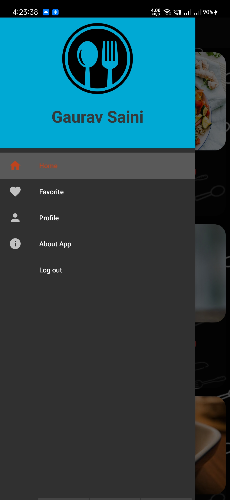

# Simple Restaurant Application.

It fetches the data from an API and displays the result in home fragment.
User can select the favorite restaurant from the home screen and can see the list in favorite section

All screens :

### Login Screen

### Registration Screen

### Forgot password Screen

### Home Fragment

### Favorite Fragment

### Profile Fragment

### About Fragment

### App Drawer

